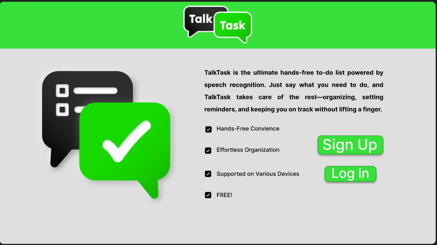

# **TalkTask**

## **Collaborators**

* Ivan Wong
* Tristan Vosburg
* Nicholas Woodley
* Raymond Cen
* Kai Lindskog
* Jordan Cowan
* Bailey Budlong

### **Abstract**

TalkTask is a web application that utilizes speech recognition to streamline to-do list management, and an AI model to provide suggested tasks. Using speech recognition, we are able to allow users to add, remove and prioritize tasks, and offer time/categorical based task views. A short article from Harvard Business Review show that effective to-do lists actually work and can release stress as tasks get checked off and/or completed. Most modern to-do list applications today rely on input form keyboards, can become long and overwhelming, and assume an infinite amount of time, hence encourages users to continiously add more tasks. *Why to-do lists don't work* is an article published by Medium and describes these exact issues on how to-do lists can become counter productive. To-do lists, either paper or electronic, can quickly become overwhelming and tedious to keep up with. If a user has many different tasks to work on throughout the day, the list can become large and difficult to structure. With TalkTask, we plan to tackle your to-do list, so you can tackle your day. TalkTask addresses the issues mentioned earlier by implementing proven strategies that increase productivity, as well as using speech recognition to make task management accessible for all users. We will also offer users a way to create multiple task lists based on their chosen category or date, so that users are able to view tasks without the daunting feeling of viewing a long list responsibilities. Furthermore, we will be using Google's Gemini AI model to provide users suggested tasks based on what the user already has to-do or has completed, offering a personalized experience for all.

### **Goals**

TalkTask should provide a hands-free and user-friendly experience for users. The platform prioritizes effective task strategies, ease-of-access, and user privacy, ensuring secure handling of voice input.

#### **Major Goals**

1. Implement essential task management features such as adding a task, marking a task as complete, and removing a task.
2. Add categorical based task views.
3. Add calendar based task views.
4. Implement a simple, but clean UI, so users can uitilize the full capabilities of TalkTask easily.
5. Use Google's Gemini AI API to provide personalized suggested tasks for users.

#### **Stretch Goals**

1. Implement reminders for timely tasks to increase the success rate of tasks being completed.  
2. Extend AI API functionality to process natural language and allow users to communicate naturally to our speech recognition system and convert their commands into a dedicated function for the to-do list management system.
3. Gamify the web application to keep current users engaged and promote continuation of using the app into continuing using our app for productivity.
4. Create a responsve UI for both desktop and mobile users.

### **Current Practice**

Current to-do lists fall into one of the two categories; electronic applications or paper lists. We won't dive deep into paper to-do lists much, but the abstract would be that they are highly customizable, but require more time and effort to create. To-do list software today suffer from over complexication or software bloat. Most software focuses on marketing their newest complex feature and stray away from what a to-do list needs to do; organize tasks, prioritizing them, and tracking progress. Traditional to-do list applications rely heavily on mouse and keyboard movement, static lists, and repetitive interactions. While major companies like Microsoft and Apple offer task management solutions, they often lack a truly intuitive and adaptive user experience.

### **Novelty**

With speech recognition, users can add, organize, and manage tasks simply by speaking, reducing friction and making task management more natural and efficient. Unlike standard apps that require constant typing and clicking, TalkTask allows users to navigate menus and execute actions hands-free, making it ideal for multitasking and accessibility.

Additionally, our AI model integration intelligently analyzes user habits, offering personalized task recommendations based on past behavior, optimizing productivity in ways that traditional to-do lists do not. Combined with a robust database-driven system, TalkTask ensures that users receive context-aware task suggestions, helping them stay organized without the cognitive load of manual planning.

Unlike many competitors, TalkTask is designed to be free of charge, accessible across devices, and built with modern technology to streamline daily productivity in a way that feels effortless and personalized. By merging AI, speech recognition, and intuitive design, TalkTask transforms the to-do list into a smarter, more dynamic productivity assistant—one that adapts to users rather than the other way around.

We offer strict categorical and day based task views to prevent overwhelming users with a long list, time blocking for tasks, prioritizing tasks, and filtering/sorting them based on priority.

### **Effects**

As with other to-do list applications, ours will help users plan their time efficiently. However, TalkTask also has greater accessibility for users, due to the speech recognition. People with disabilities will find it easier to use compared to traditional lists, and not all applications have this accessibility option. Non-native speakers will also have their experience improved, as there are multiple language options. Our application focuses on accessibility first, as that is very important for software that a lot of different people might use. Because of this focus on efficiency and accessibility, multitaskers will also enjoy using the software. They can use voice recognition to quickly create and edit lists, compared to the more traditional, slower applications. We want to create an application that is simple to use but that also accompanies different types of users. If successful, our application will be easier to use than previous to-do lists and address previous accessibility concerns.

### **Use Cases**

* **Case Designer:** Ivan Wong
* **Title:**
  * Website navigation
* **Actors:**
  * User interacting with the website.
* **Triggers:**
  * The user wants to access a specific feature of section within the web application without unecessary steps or confusion.
* **Preconditions:**
  * User's device is connected to the internet or has internet access.
  * User has launched TalkTask web page.
  * The navigation system is operational
  * The web page is responsive to user input.
* **Postconditions:**
  * The user is directed to the intended section or feature they requested.
  * The navigation system remains operational after navigating to their desired section or feature.
* **List of steps:**
  1. The user opens the TalkTask web page.
  2. The user interacts with the navigation system, such as clicking a button or using speech recognition to access sections or features.
  3. The system processes the input correctly and provides feedback, expected section, or expected feature for the user.
  4. The user is able to access the desired content or functionality with minimal effort.
* **Extensions/variations of the success scenario:**
  * The user uses buttons to navigate through specific sections or features within the system.
  * The user uses the keyboard and shortcuts to navigate through the web page and sections with ease.
  * The user uses speech recognition to let the web page process voice commands into navigation to specific sections or features within the system.
* **Exceptions (failure conditions and scenarios):**
  * Broken links or buttons that lead to 404 error page; displays a message to refresh page or try again later.
  * Slow loading, so navigation is delayed due to poor internet connection; system displays a loading spinner or error message.
  * Unresponsive navigation system, where the web page does navigate to section as intended; prompted to refresh page.
  * Unclear navigation system, where buttons or labels are confusing; an additional tooltips pop-up or page is provided to help guide users through webpage.

* **Case Designer:** Tristan Vosburg
* **Title:**
  * Persistent task storage
* **Actors:**
  * All users
* **Triggers:**
  * When a user access the application for a second time
* **Preconditions:**  
  * The user has their schedule saved on a server and it can be accessed as needed.
* **Postconditions:**  
  * If a user accesses the file on their account for the second time, all the info they wrote on the last use is still present.
* **List of steps:**
  * Log in to the application for the first time.  
  * Input an event
  * Save
  * Log Out
  * Log In at a later time
* **Extensions/variations of the success scenario**
  * User inputs should continue to be tracked and saved through any number of logins.
* **Exceptions: failure conditions and scenarios**
  * If the user doesn't save, their inputs won't be saved.

* **Case Designer:** Nicholas Woodley
* **Title:**
  * Remove task with voice command
* **Actors:**
  * All users
* **Triggers:**
  * The user activates the voice command to remove a task
* **Preconditions:**
  * The user has an internet connection
  * User is logged in
  * The task to be removed exists
* **Postconditions:**
  * The specific task is removed from the to-do list
  * The updated list is displayed without the removed task
* **List of steps:**
  1. User activates voice command on application
  2. User speaks the command
  3. TalkTask processes the command and identifies which task is supposed to be removed
  4. TalkTask checks if the task exists
  5. If the task exists, then it is removed
  6. The application displays the updated to-do list
* **Extensions/variations of the success scenario**
  * User gets confirmation to remove before the task is deleted
  * User can specify multiple tasks to be deleted
* **Exceptions: failure conditions and scenarios**
  * Task not found: if no task is found, then the system will notify the user that the selected task does not exist
  * Multiple tasks with similar name: If multiple tasks exists with similar names, the system will ask the user to clarify which task to remove
  * No tasks exist: the system will notify the user that no tasks exist
  * Speech error: the system will ask the user to repeat their command

* **Case Designer:** Kai Lindskog-Coffin
* **Title:**
  * Free access to web application and it's features
* Actors: College student who needs to cut down on costs/ be more conscious of their spending.
* Triggers: The user needs to monitor their spending, as well as when and where their money is leaving their account.
* Preconditions:
  1. User has access to TalkTask.
  2. Application is connected to the internet.
  3. The user has created an account.
* Postconditions:
  1. A task for the recurring payment or subscription is created.
  2. Task is stored in database.
* List of steps:
  1. User opens TalkTask.
  2. User logs into TalkTask
  3. User can either speak or manually enter their recurring payment/subscription as a task.
  4. User can specify when this bill is due (e.g. monthly, weekly, yearly, etc.)
  5. System creates the task.
  6. Task is stored in the database and registered to the user.
  7. TalkTask will remind them to pay it next month.
* Extensions/variations of the success scenario:
    Users can add multiple recurring payments at once, each being registered as separate bills.
* Exceptions:
  1. Recurring payment was canceled and not updated in TalkTask.
  2. User does not enter a recurring date of payment.

* **Case Designer:** Raymond Cen
* **Title:**
  * Updating a task
* **Actors:**
  * Student
* **Triggers:**
  * The student has many assignments due this week.
* **Preconditions:**
  * The student is already enrolled in classes with assignments to complete.
* **Postconditions:**
  * The student can mark tasks as complete or update them.
* **List of steps:**
  1. The student logs into the system using valid credentials.
  2. The student creates a new task.
  3. The application adds the task.
  4. The student can create, edit, delete, mark them as complete and rearrange the order of tasks by due date or priority.
* **Extensions/variations of the success scenario**
  * Student can set special reminder notifications such as weekly quizzes.
* **Exceptions: failure conditions and scenarios**
  * The student leaves in the middle of the creating a task.
  * The student does not meet the deadline of the assignment.

* **Case Designer:** Bailey Budlong
* **Title:**
  * Adding a task via mouse and keyboard input
* **Actors:**
  * The user who is a student
* **Triggers:**
  * They have been given a homework assignment
* **Preconditions:**
  * They have access to TalkTask
* **Postconditions:**
  * An entry in TalkTask has been made for their homework assignment
* **List of steps:**
  1. User opens the TalkTask application
  2. User logs into Talktalk
  3. From the home screen, user clicks on create new task button
  4. User fills in data fields in task creation window
  5. User clicks out of the task creation window
  6. Task is created and saved
* **Extensions/variations of the success scenario**
  * User duplicates or edits existing task to track new task.
* **Exceptions: failure conditions and scenarios**
  User enters invalid data into task creation fields, and is presented an error.
  User decides that Talktask is able to sufficiently track their task, and leaves.

* **Case Designer:** Jordan L Cowan
* **Title:**
  * Adding a task via voice commands
* **Actors:**
  * Users want to add a task hands-free.
* **Triggers:**
  * The user prefers to use speech-to-text.
* **Preconditions:**
  * The user has pressed the button to enable speech-to-text.
* **Postconditions:**
  * The user can speak and it will be transferred to text and create a task for the user.
* **List of steps:**
  1. The user presses the speech-to-text button
  2. The user says their tasks
  3. The system recognizes the speech and converts it to text
  4. The system parses the text input to identify the parameters (the task, due date, type)
  5. The task is created using the parameters.
* **Extensions/variations of the success scenario**
  * The user pauses mid-sentence and the system prompts for clarification
  * The user keeps talking and doesn’t realize the speech-to-text is still running any excess text is filtered
* **Exceptions: failure conditions and scenarios**
  * If the voice input isn’t recognized then provide a prompt for retrying or manual input if it can’t.
  * Background noise interference then prompt the user to try again in a quieter environment.

### **Non-functional Requirements**

* When code is deployed for users to access, it should be kept and maintained with security in mind. Users will not be able to access the database and data will not be shared with any third-parties. Bad-faith actors shouldn't have easy access to any holes.
* The application should work across all devices ranging from desktop to mobile phone. All features including the voice input and UI should seamlessly work across all platforms.
* The application should be able to handle a large influx of users. There should be minimal peformance issues and the application should stay functional and responsive if lots of users are using it.

### **External Requirements**

* **How we’ll host the application for users to access:**
  * TalkTask will be divided into two servers to seperate concerns for modular, and scalable software. Deployment tools will include Netlify for the frontend server and backend deployment tools are still being researched to find open source tools that are free to use and fit our use cases.
* **How we’ll handle errors, invalid user inputs, etc:**  
  * For WebSpeechAPI, when the user uses the voice input feature it will check if the command given matches any of the current commands. If not it will reprompt the user, asking the user to say the command again. But if it does match a functionality, it will prompt a confirmation screen while keep the voice input on. That way the user can confirm the action by saying "yes" or "no".
  * For the database, if the connection with the database fails a notification will popup to alert the user that their data cold not be retrieved. We'll ask the user to refresh the page and if the issue presists, we'll ask the user to contact the database develoepr or backend developer to resolve the issue.
  * For adding a task, without using the WebSpeechAPI and manually typing into it, if the user exits out the add task menu without saving the task, it will prompt the user with a confirmation notification only if they have filled in a field. If the user exits out the webpage when adding a task then the task will not be added. If the user accidentally hits the "remove task" button, a confirmation notification will pop up, so they don't immediately remove a task. If they are editting a task, just like adding a task, a confirmation will pop up if they try to exit out only if something has been changed from the original task.
* **How we’ll allow others to setup their own instance of our application:**
  * Refer to configuration.md in our git repository.
* **How we'll take external feedback:**
  * Important feedback we'll need from people outside of our website will include all aspects of our web page from a user being able to login to a user wanting a suggested task using speech recognition. The most critical point of feedback will be during our speech recognition and AI suggested tasks. The tester should be able to speak into their device and add the desired tasks and be able consider adding the suggested task into their list.
  * We will have a section/page that is dedicated for feedback. It will contain two fields, an email and textbox. The user will have to enter a valid email address and a message that they want to send to the developer.

### **Technical Approach**

TalkTask will be created using the MERN technology stack (MongoDB, Express.js, React, Node.js), Tailwind CSS, and Auth0 for user authentication. Once an MVP is developed, we will use Netlify to host our frontend services and Render to host our backend services with GitHub actions for our CI pipeline.

To use TalkTask, a user will have to first enter our URL into a web browser. Once rendered properly, they will be directed to our landing/about page which includes a brief description of what TalkTask is and signup/login button. Both buttons link to the Auth0 authentication page where a user can continue by entering their email and password, or by using an external authentication service like Google or GitHub. Once logged in, the user will be presented to their home page which includes an intuitive UI design and button animations to direct the user into using application accordingly.

Major components we will develop will include...

* Task Management System
  * Core to-do list functionality for CRUD operations.
* Speech Recognition and Voice Commands
  * WebSpeech API to capture user speech input.
* AI Powered Suggested Tasks
  * Given the titles of a users tasks, this component shall produce a logically related task.
* User Authentication
  * Authorizes and authenticates that a user is able to use our app and access their own data.
* Database Management
  * Ensures that tasks can be stored securely and allow users to access their data on various devices.
* Clean/Intuitive UI
  * Design an easy to use UI ensures that our web app focuses on the user experience and helps them become more productive.
* CI Pipeline and Testing
  * Ensures that our push and pull requests aren't breaking or failing previous working features.

### **Risk**

* We all have different coding styles and levels of coding competence, so pushing effective and efficient code depends on our coding skill. To avoid "bad code" being pushed, we plan on designing our features, so that they will rely on dependencies and by keeping a modular design, we are able to develop features in parallel, increasing productivity and speeding up the SDLC for a MVP and/or a finalized product. If any bugs or erros occure, we are able to easily locate where the issue is coming from and discuss a fix for it.
* Underestimating the work required to complete certain tasks could impose deadline risks. To avoid this problem, we plan on setting checkpoints for what we expect to have completed each week. Additionally, each checkpoint will have small tasks associated with it. Each group member will be responsible for completing their small tasks. At each stand-up meeting, the status of each small task will be checked in to see if help is needed, changes need to be made, or if our stretch goals can be attempted because we are ahead of schedule.
* Implementing a user database so that separate users can use the application, along with state being preserved between uses and devices. To minimize the risk of difficulty of this task, we will ensure that team members with skills in database managment or have previously taken a database course at OSU will be responsible for leading the database development side of things.
* Implementing the main features with the WebSpeechAPI and the open source AI model. These will impose risks because our program must be able to handle all to-do list functionality through speech, so being able to parse and process voice commands will be a challenge. Adding AI features will also include another layer of complexity because our program must be able to handle the AI processing data and producing tangible results that we as developers, must be able to verify with unique test cases. Our plan to simplify these last two processes is by utilitizing internet sources, documentation, and implementing these features incrementally, so that we can push a MVP earlier and break down full functionality into smaller, more manageable tasks.

### **Team-Info**

* Ivan Wong (Fullstack Developer)
  * Responsible for researching frameworks, APIs, configuring Git repo for easier development, and keeping files modular and organized. This role is needed because with many APIs frameworks being used, their needs to be a dedicated person to research which tools would help speed up production and keep everything orgranized for scalability and future feature implementations. I am best suited for this role because I have experience in configuring build environments for GUI applications and have devloped & deployed my own frontend portfolio website using similar tools.
* Tristan Vosburg (Back-End Developer)
  * TalkTask will need a way to communicate between the front-end and the database. Without this, the website wouldn't be able to store information between log-ins.  Building this bridge will be a large part of what will allow TalkTask to work.
* Nicholas Woodley (Front-End Developer)
  * Responsible for front-end navigation, pages, and other accessibility features needed for the to-do list.
* Kai Lindskog-Coffin (Database Developer)
  * TalkTask will need to log user information, including login information, and previous tasks. I really enjoyed CS 340: Introduction to Databases, and I feel that I can create a database that can manage user data in a secure and efficient manner.
* Raymond Cen (Back-End Developer)
  * Responsible for the use of the WebSpeechAPI and the communcation between frontend and backend.This role is needed because the use of voice input using WebSpeechAPI is a main component of this project. As well as communication between the frontend and backend. I am best suited for this because I have experience in working with APIs in a web project and designing a communucation pipeline between a frontend file and backend file.
* Jordan L Cowan (Front-End Developer)
  * It will be very important for the website to look good, work great, and have easy use not only for everyday users but also for those who need proper accessibility in their apps. I am very particular with most styling placing me as a good fit for this section and for creating the accessibility I have grown up having to help with accessibility for family members helping me know the importance of having great accessibility within apps.

### **Software Toolset**

Because many APIs will be used for developing TalkTask, I will only go over the essentials and define how these tools will be used, as well as why they are being used. More tools will be researched and added to the list as we get closer to the final product, as to not get overwhelmed in the beginning.

* React Framework:
  * React will be used to design the frontend side of things. Not only will this introduce us the React framework which is widely used in web development industry, but it offers component based architecture and allows for easier scalability and modularized practices, allowing for easier readability and development.
* Node.js:
  * Node will be used to not only install dependencies in our build environment, but also run JavaScript in server-side logic to allow high performance, real-time data updates, interacting with the database, and consistency across developers using the same language.
* Express API:
  * The Express API will be used to run our backend server and simplify our server setup source code. It will also provide middlware support which makes it easier to extend functionality of to-do lists management functionality and powerful routing functionality.
* Vite Build Tool:
  * Vite is a blazing fast frontend building tool that utilizes modern JavaScript functionality and is optimized to obtain faster and more high performance websites compared to the widely used Webpack build tool.
* WebSpeech API
  * The WebSpeech API is a JavaScript interface that allows users to incorporate speech recognition as data for our web application. This will be one the main APIs for our program, so that we can integrate voice commands from the user into to-do list funcitonality, to provide a hands-free experience and more accesibility features.
* Google Gemini AI API
  * Allows us to produce suggested tasks for users based on their previous ones. This tool will primarily be used for recommending tasks and one of our stretch goals is to use this API to process natural language into to-do list functionality, so that our web application is even easier to use.
* MongoDB:
  * MongoDB is going to be used to grant us access to a database. Team members in our group have free access to the database throufh previous or current OSU courses, so MongoDB was chosen to store user tasks in a JSON like format. A data base allows users to access tasks across multiple devices and allow our AI model to pull tasks from the database to produce suggestions.
* Render
  * Render is a web service platform that offers free hosting with limited resources. Since this project isn't expected to go big anytime soon, the free plan Render offers should be enough to allow our peers to test the web application on the internet.
* Figma
  * Figma will be used by our UI/UX designer to design our web pages. The mockups will be used for our frontend developers to reference what we will be creating.
* Auth0 API
  * The Auth0 API will allow users to create and login to their accounts safely and securely across multiple devices to access their data. The Auth0 API gives us developers to seamlessly authenticate and authorize users to provide them with corresponding data and permissions.
* TailwindCSS
  * TailwindCSS is a CSS framework that helps simplify the development process by providing pre-designed utility classes. It allows custom designs without writing your own custom CSS and simplifies the development of responsive designs.
* Jest.js
  * Jest is a testing library that allows to create unit tests for our components, and display them in a neat way. Jest allows to run all tests using a npm script and displays what tests failed, where it failed, and how long they took, so it makes it really easy to analyze where things go wrong.

### **Project Schedule**

| Group               | Wk 3 | Wk 4 | Wk 5 | Wk 6 | Wk 7 | Wk 8 | Wk 9 | Wk 10 |
| --------------------|------|------|------|------|------|------|------|------ |
| Front End           |Design Navigation|Start front-end implementation|Test and connect front-end calls to back-end|Implement API to front-end calls|Develop user feedback features|Implement other features (such as notifications)|Finalizing and testing|Deploy and finish documentation|
| Back End            | Design for communication with WebSpeechAPI completed|List of commands and functions determined|WebSpeechAPI coded into backend|Save Button Works / WebSpeechAPI implemented for add and remove functionality |WebSpeechAPI fully implemented with full functionality into backend|Testing and ensuring proper function of WebSpeechAPI|Communication between frontend and backend is fully established and ready.|TalkTask web page completed, deployed and being maintained.|
| UI/UX               |UI Sketches|Draft Figma wireframe UI design|Incorporate group feedback, draft designs for all UI elements/pages|Visual styling decided, Unique visual assets generated|Preliminary front end implemented with front end developers|Test UI functionality for revisions|Make final changes for UI design and assets|Verify UI is functioning and correct|
| Fullstack |Essential tools needed for basic web server configuration and to-do lists management added to dependencies.|Files organized in a modularized manner to allow for easier implementation and OO practices.|Database implementation inputs correctly formatted data.|AI and WebSpeech APIs configured and ready for developers.|To-do list functionality completely finished and implemented, so that integrating AI and speech recognition features are done seamlessly.|Continue developing complex features, such as AI and speech recognition implementations.|Implement stretch goal features, such as reminders for timely tasks and processing natural language using WebSpeech API and AI API model.|Run and test finalized product for any underlying bugs or errors.|

### **Software Architectiure**

**Client-Server**


* To maximize the bandwidth usage of our deployement services, we will be using client server architecture. The client will be what the user interacts with. The client is responsible for displaying data for the user and making API calls to the backend server. The server will be used to handling incoming requests from the client and is responsible for processing data.

**User Login**


* Because a to-do lists contains sensitive information about a user, we need to describe how our web application provides security for users. The OAuth or Auth0 API grants users authorization and authentication to access their data and make API calls to protected URI routes.

**Backend MVC (Model Views Controller) Architecture**


* MVC architecture will be used to keep our backend logic modular and provide software maintenance. The client will make an HTTP request to the server which goes through a dedicated CRUD route and go to a controller component. The controller is responsible for the HTTP logic and uses services to process the data before sending a response back to the client to display the views.

**To-Do List Input Architecture**


* Getting input from the user can be done via mouse and keyboard movements, or through voice commands. Once the inputs is obtained by the frontend, it is then sent to the backend to be processed.

**To-Do List Processing Architecture**


* Processing the input obtained from the user is done by the frontend or client, which then makes an HTTP request. The server captures the request, sends it to the linked controller, processes the data, edits the database if necessary, and sends back a response for the frontend to be updated.

#### **Schemas**

##### **Task Schema**

| Field | Type | Description |
|---------------|-----------------------|---------------------------------------------------|
|taskID|Number (Unique) |Unique identifier for each task|
|description   |String |Task description |
|dateStarted   |Date  |Timestamp when task was created  |
|dateCompleted  |Date |Timestamp when task was completed |
|recurringDate  |Date |If the task repeats, its recurrence date |
|priority |Number |Priority level (1-3) |
|status |Bool |Task status (true - completed) (false - incomplete) |
|userID |String  |Unique ID linked to a specific user|

##### **Category Schema**

|Field|Type|Description|
|-----|----|-----------|
|name|string|Name of category|
|userID|string|Unique ID linked to a specific user|

#### **Interfaces**

* Frontend (React) and Backend (Node.js)
  * The frontend will use restful api calls to communicate with backend, using HTTP requests (GET, POST, PUT, DELETE). The frontend interacts with the backend to fetch and modify to-do list data, task management, and other api calls.
* Backend (Node.js) and Database (MongoDB)
  * The backend stores and retrieves data from MongoDB, and will use MongoDB to perform CRUD operations on the data entered. The backend also makes sure that these database calls follow data integrity rules.
* Frontend (React) and Speech Recognition (Web Speech API)
  * The frontend will use JavaScript API calls to capture voice commands and convert them into text to send to the backend. The API calls will happen when a button is pressed, and the data passed will be plain text.
* AI Model (Gemini Flash 2.0) and Backend (Node.js)
  * The backend will send http api calls (JSON format) to get suggested tasks from the AI model. An example of this could be POST /ai/suggest-task, which sends previous tasks and receives AI-generated suggestions
* Authentication (Auth0) and Frontend (React) and Backend (Node.js)
  * The page in the frontend will send a call to the Auth0 API when a login button is pressed. The backend then handles the information and makes sure the authentication was successful.
* Frontend Deployment (Netlify & Vite) and Users
  * The frontend deployment will use webpages and other assets to allow users to access the to-do list application.
* Backend Deployment (Render) and Frontend & Database
  * Render will host backend logic for the frontend and database to interact with.

#### **Assumptions**

* WebSpeech API Will Accurately Process Commands
  * Assumption: The WebSpeech API will correctly interpret voice commands
  * Justification: Although voice recognition technology has advanced, performance may still be impacted by elements including background noise, accents, and speech clarity. Manual input and error handling act as mitigating measures.
* MongoDB Can Handle Dynamic and Scalable Data
  * Assumption: MongoDB will accommodate an expanding user base while managing structured and unstructured data effectively.
  * Justification: Because MongoDB is a flexible NoSQL database, it can grow with the system without being constrained by rigid schemas.
* AI Task Recommendations Will Improve User Experience
  * Assumption: AI-powered suggestions (using Hugging Face) will provide relevant and helpful task recommendations.
  * Justification: The AI model makes the assumption that there is sufficient task data from the past to generate relevant predictions. The accuracy of recommendations may suffer if users have insufficient history.
* Authentication via Auth0 Will Be Secure and Reliable
  * Assumption: Auth0 will provide secure, seamless authentication across devices.
  * Justification: Third-party authentication services like Auth0 are trusted for handling OAuth logins and security, reducing development overhead.
* Hosting Services (Netlify & Render) Will Provide Stable Deployment
  * Assumption: Netlify (Frontend) and Render (Backend) will offer reliable uptime and performance.
  * Justification: These platforms are widely used for web applications and include free tiers, but scalability issues may arise with high traffic.
* Users Will Want Cross-Device Accessibility
  * Assumption: Users will want to access their to-do lists from multiple devices.
  * Justification: A cloud-based approach ensures synchronization across desktops and mobile devices, making the system more convenient.

### **Software Design**

* **Speech Recognition Component**
  * Uses WebSpeechAPI to capture and process voice commands.
  * Speech command extracts task-related information from speech.
  * Error Handling & Feedback prompts users for retry or manual input if speech is unclear.
* **Task Management System**
  * Task model (MongoDB) defines task structure (title, due date, priority).
  * Task controller (Backend API) handles task creation, editing, deletion, and retrieval.
  * Task service (Business Logic) manages sorting, prioritization, and recurrence.
  * Task UI components (React) displays task lists and controls.
* **User Authentication & Account Management**
  * User model stores login credentials securely with encryption.
  * Authentication controller (Backend API) handles registration, login, and logout.
  * Session management maintains user authentication across sessions.
* **AI-Based Task Recommendation System**
  * Gemini Flash AI analyzes past tasks to suggest new ones.
  * Recommendation system learns user habits and prioritization patterns.
  * User preference storage retains AI suggestions and personal task habits.
  * AI model provides error handling for empty lists and junk task titles
* **Database & Storage**
  * MongoDB + Mongoose stores user tasks, preferences, and AI data.
  * Data backup & sync ensures consistency across multiple devices.
* **Frontend UI & User Experience**
  * React components for task management, navigation, and interaction.
  * Navigation bar ensures smooth movement between app sections.
  * Accessibility features include voice support.
* **Backend API & Server Logic**
  * Express.js server processes user requests and communicates with the database.
  * Middleware validates inputs and enforces security policies.
  * API Routes define endpoints for tasks, authentication, and AI recommendations.

#### **UI Mockups**

### About/Landing Page




### User Home Page


#### **1️ Risk: Speech Recognition Accuracy Issues**

* **Likelihood:** **High**
* **Impact:** **High**
* **Evidence:**
  * Speech recognition models struggle with different accents, background noise, and ambiguous commands.
  * WebSpeech API has limitations, such as requiring internet access and limited offline support.
  * User testing in different environments exposes inconsistent recognition rates.
* **Mitigation Steps:**
  * Conduct **usability testing** with diverse users.
  * Implement **error handling & retry mechanisms** for unclear commands.
  * Allow **manual task editing** in case of recognition failure.
  * Use **AI-powered NLP** to interpret voice commands more flexibly.
* **Detection Plan:**  
  * Implement **logging for failed speech-to-text conversions**.
  * Track **user feedback** for misrecognized commands.
* **Mitigation Plan (If it Occurs):**  
  * Implement **fallback manual input methods**.
  * Optimize **voice command structure** (e.g., “Add task [task name] due [date]”).
* **Changes Since Requirements Document:**  
  * Added **fallback options** (manual input, confirmation prompts, AI-enhanced NLP).

#### **2️ Risk: Backend & Database Integration Issues**

* **Likelihood:** **Medium**

* **Impact:** **High**
* **Evidence:**
  * The backend must support **real-time task updates** across devices.
  * MongoDB schema must handle **user authentication**, **task management**, and **AI recommendations**.
  * API failures could lead to **data inconsistencies** (e.g., task duplication).
* **Mitigation Steps:**
  * Define **clear API endpoints** and test early.
  * Implement **database indexing** for performance optimization.
  * Use **MongoDB transactions** to prevent inconsistent task states.
* **Detection Plan:**  
  * Write **unit tests** for database operations.
  * Use **Postman & Jest** for API testing.
* **Mitigation Plan (If it Occurs):**  
  * Implement **logging and error recovery** (e.g., retry failed database operations).
  * **Backup task data** to prevent loss.
* **Changes Since Requirements Document:**  
  * More emphasis on **testing and database integrity checks**.

#### 3️ Risk: User Adoption & Accessibility Issues

* **Likelihood:** **Medium**

* **Impact:** **High**
* **Evidence:**
  * Users may struggle with **speech-based navigation**.
  * Accessibility concerns for **speech-impaired users**.
  * Some users may prefer **keyboard/mouse over voice input**.
* **Mitigation Steps:**
  * Design **multi-modal interaction** (support both speech and manual inputs).
  * Ensure compliance with **WCAG 2.1 accessibility guidelines**.
  * Gather **early user feedback** via surveys and beta testing.
* **Detection Plan:**  
  * **Track feature usage** (e.g., how often users switch to manual input).
  * **Monitor support requests** related to accessibility.
* **Mitigation Plan (If it Occurs):**  
  * Offer **customizable input options**.
  * Introduce **keyboard shortcuts** for key functionalities.
* **Changes Since Requirements Document:**  
  * Added **manual fallback options** and ensured **accessibility compliance**.

#### **4️ Risk: AI Task Recommendation Limitations**

* **Likelihood:** **High**
* **Impact:** **Medium**
* **Evidence:**
  * AI recommendations rely on **user task history**.
  * Poor dataset or limited data can lead to **irrelevant suggestions**.
  * AI models might **misinterpret** user needs.
* **Mitigation Steps:**
  * Allow users to **provide feedback on AI suggestions**.
  * Use **a mix of rule-based logic and AI** for better recommendations.
  * Store **user preferences** to fine-tune AI behavior.
* **Detection Plan:**  
  * Track **AI-generated task acceptance rates**.
  * Monitor **user-reported errors** in AI recommendations.
* **Mitigation Plan (If it Occurs):**  
  * **Refine the AI model** based on real-world data.
  * Implement a **"smart filter"** to eliminate irrelevant tasks.
* **Changes Since Requirements Document:**  
  * Added **feedback collection mechanism** to refine AI suggestions.

#### **5️ Risk: Deployment & Hosting Challenges**

* **Likelihood:** **Medium**
* **Impact:** **High**
* **Evidence:**
  * Need to support **frontend (Netlify)** and **backend (Render)** hosting.
  * Backend could **exceed free-tier limitations** (e.g., MongoDB request limits).
  * Risk of **downtime or unexpected hosting costs**.
* **Mitigation Steps:**
  * Use **logging & monitoring tools** (e.g., PM2 for Node.js).
  * Keep **database queries optimized** to minimize API calls.
  * Have **contingency plans** for hosting (e.g., AWS, DigitalOcean).
* **Detection Plan:**  
  * Monitor **server logs** for errors or high resource usage.
  * Implement **uptime monitoring tools** (e.g., UptimeRobot).
* **Mitigation Plan (If it Occurs):**  
  * Migrate to **a more scalable hosting provider** if needed.
  * Implement **rate limiting & caching** to reduce API load.
* **Changes Since Requirements Document:**  
  * More emphasis on **scalability** and **backup hosting solutions**.

### **Group Project Schedule**

* Notable conflicts and updates to our schedule are what features are dependant on others being done to be completed.  Specifically, features that interface with the database need to have the database set up, and back-end support before they can be functional.  Other than this, there have been no changes to the schedule.
* Before implementing the frontend: UI design, API design, and basic backend setup.
* Before implementing the backend: Database design and frontend design.
* Before implementing the database: Backend to make sure data is being stored correctly.
* Before testing frontend/backend: Frontend-backend interaction must be functional.
* Before small use cases: implementation of frontend and backend must be finished (at least the part that the use case is concerned with).

* 1 is a 1 week milestone, 2 is a 2 week, and 3 is a 3 week.

| Group               | Wk 3 | Wk 4 | Wk 5 | Wk 6 | Wk 7 | Wk 8 | Wk 9 | Wk 10 |
| --------------------|------|------|------|------|------|------|------|------ |
| Front End           | Design Navigation (1)|Start front-end implementation (2) |Test and connect front-end calls to back-end(2)|Implement API to front-end calls(1)|Develop user feedback features(1)|Implement other features (such as notifications)(2)|Finalizing and testing(1)|Deploy and finish documentation(1)|
| Back End            | Design for communication with WebSpeechAPI completed(1)|List of commands and functions determined(1)|WebSpeechAPI coded into backend(2)|Save Button Works / WebSpeechAPI implemented for add and remove functionality |WebSpeechAPI fully implemented with full functionality into backend|Testing and ensuring proper function of WebSpeechAPI|Communication between frontend and backend is fully established and ready(1)|TalkTask web page completed, deployed and being maintained(1)|
| UI/UX               |UI Sketches(1)|Draft Figma wireframe UI design(1)|Incorporate group feedback, draft designs for all UI elements/pages(2)|Visual styling decided, Unique visual assets generated(1)|Preliminary front end implemented with front end developers(2)|Test UI functionality for revisions(1)|Make final changes for UI design and assets(1)|Verify UI is functioning and correct(1)|
| Database            |Design database schema (1)|Set up MongoDB (1)|Configure database for tasks(2)|Implement save, update, and delete functionality (2)|Integrate AI and WebSpeech API with database (2)|Ensure data is correct between backend and database(2) |Testing and ensuring database integrity (2)|Final database testing and deployment (1)|
| Software Management |Essential tools needed for basic web server configuration and to-do lists management added to dependencies.(1)|Files organized in a modularized manner to allow for easier implementation and OO practices.(1)|Database implementation inputs correctly formatted data.(1)|AI and WebSpeech APIs configured and ready for developers.(1)|To-do list functionality completely finished and implemented, so that integrating AI and speech recognition features are done seamlessly.(3)|Continue developing complex features, such as AI and speech recognition implementations.(2)|Implement stretch goal features, such as reminders for timely tasks and processing natural language using WebSpeech API and AI API model.(1)|Run and test finalized product for any underlying bugs or errors.(1)|

### Coding Guidelines

* JavaScript (React/Node.js)
  * Guideline: JavaScript Style Guide (<https://github.com/airbnb/javascript>)
  * Reason: Airbnb's style guide is widely adopted in the industry, comprehensive, and covers both JavaScript and React best practices. It promotes clean, readable, and
maintainable code.
  * Enforcement: Use ESLint with the Airbnb configuration (eslint-config-airbnb) to automatically enforce the rules during development.
* HTML
  * Guideline: HTML Style Guide (<https://google.github.io/styleguide/htmlcssguide.html>)
  * Reason: Google's style guide is simple, well-structured, and focuses on best practices for writing clean and semantic HTML.
  * Enforcement: Use an HTML linter like htmlhint with a configuration aligned with the Google style guide.
* CSS
  * Guideline: CSS Style Guide (<https://google.github.io/styleguide/htmlcssguide.html>)
  * Reason: The same guide covers CSS, ensuring consistency in styling practices and maintainability.
  * Enforcement: Use a CSS linter like stylelint with a configuration aligned with the Google style guide.
* MongoDB
  * Guideline: MongoDB Best Practices/Style Guide (<https://www.mongodb.com/docs/meta/style-guide/>)
  * Reason: MongoDB's official documentation provides clear and practical guidelines for database design, indexing, and query optimization.
  * Enforcement: Code reviews and manual checks during development to ensure adherence to best practices

### **Documentation Guides**

* **User Guides (TalkTask)**
  * TalkTask will include a help page that lists all commands/functionality we are providing to help users navigate through our web application and use it to it's full potential.

* **Developer Guide**
  * This section has already been started with our configurations.md file provided in the Git repository. It is currently still in progress, as more APIs are being introduced with some needing specific API keys that need to be added to a developers workspace, so the file will be updated accordingly. The current contents of the file show developers how to run and build the full project on their local host IP, and once the configurations branch is finished, deployement strategies will be added.

* **User Documentation**
  * High Level Description: TalkTask is a voice-controlled task management system designed to help users manage their daily tasks hands-free. The application integrates speech recognition and AI-based task recommendations to provide an intuitive to-do list experience
  * How to install:
    * Prerequisites: Web browser such as Chrome, Mozilla, Safari, etc.
    * Installation Steps:
      * Talktalk is a web application, no need to install any outside software
  * How to run:
    * Enter our URL to a web browser of your choice on either desktop or mobile devices.
  * How to use software:
    * Once we get our website up and running, we will instruct users to...
      1. Create an account via Email and password or your choice of service provider via OAuth, or login to an existing account.
      2. Manage tasks using the task management list buttons or click other task lists on the sidebar - Functionality in progress
  * How to report a bug:
    * If a bug is found in our application, they can be reported on the Github Issues page in our repository. Click "new issue", and provide these details: a concise title, steps to reproduce the issue, error messages, expected behavior, and other additional information.
  * Known bugs:
    * Known bugs will be kept in the Github Issues page. In order for users to not see the trivial bugs, issues will be assigned a label "major", "minor", "critical". Resolved issues will be removed or archived from the issues page.

* **Developer Documentation**
  * How to obtain source code:
  Source code for this project can be entirely found at [our GitHub repo](https://github.com/IvanW5X/CS362-Winter2025-Team20-TalkTask).
  To clone the repo:
    * Enter the directory where you want the repository to be cloned too.
    * Make sure you have [git installed](https://gitforwindows.org/)
    * ```git clone https://github.com/IvanW5X/CS362-Winter2025-Team20-TalkTask```
    * Make sure you have an LTS release of [node.js installed](https://nodejs.org/en)
    * ```cd ./frontend/```
    * ```npm i```
    * ```cd ./..```
    * ```cd ./backend/```
    * ```npm i```
    This will clone all source code we have written.  Additionally, it will install all necessary npm packages we need for source code to work.  The list of packages for the front and backend are found in their respective ```package.json``` files.

  * Directory structure:
    * **Assignments**:
      * Holds our architecture diagrams and assignments.
    * **Designs**:
      * Holds our Figma designs.
    * **Documents**:
      * Holds our main documents relating to our resources and configuration.
    * **Reports**:
      * Holds our weekly reports.
    * **Frontend**:
      * Holds our frontend components, pages, assets, and frontend related service files.
      * **Tests**
        * Holds test JSON files and other test related files for frontend components
    * **Backend**:
      * Holds our backend sources files
      * **Tests**
        * Holds test JSON files and other test related files for backend logic and components
  * How to build:
    * Prerequisites: Node.js, MongoDB, Google Gemini 2.0 API
    * Backend:
      1. Obtain an API key from and Google's AI API and obtain a mongoDB URI
      2. From root directory, type 'cd backend' into the terminal and hit enter
      3. Type 'npm run dev' + enter to run the server in developer mode
    * Frontend:
      1. From root directory, type 'cd frontend' into the terminal and hit enter
      2. Type 'npm run dev' + enter to run the client in developer mode
  * How to build a specific release:
    * Choosing a Release:
      1. In the main directory of the git repository open the terminal
      2. Type 'git tag'
      3. This should display a list of available releases, choose the release you would like
      4. Type 'git checkout < tag-name >'
    * Above this guide you will find the 'How to build' guide follow that to build your chosen release.
    * Switching back to main (optional):
      1. Open Terminal
      2. Type 'git checkout main'
  * How to test:
    * Jest will be used to test both our frontend and backend.
    * We will create a directory named "test" in the frontend and backend which will hold all of our tests.
    * Inside each test directory we will have JavaScript files that name ____.test.js based on which part we are testing.
    * Navigate to either the frontend or backend and have the Jest package installed.
    * Run the command ```npm run test```.
    * Results will be displayed into the terminal.
    * You can also run ```npm run test --coverage``` to see a detailed report on the coverage of the test. Showing which lines were and were not covered by the test.
  * How to add a test:
    * Inside the folder we will create a file and write a test using Jest's API.
    * Save the file.
    * Run ```npm run test```
  * How to build a specific release:
    * For specific releases navigate to the branch you are interested in using.  Then, clone it with the link provided by GitHub.  Then, follow the next steps depending on which part of the application you want to run.
    * Prerequisites: Node.js, MongoDB, Google Gemini 2.0 API
    * Backend:
      1. Obtain an API key from and Google's AI API and obtain a mongoDB URI
      2. From root directory, type 'cd backend' into the terminal and hit enter
      3. Type 'npm run dev' + enter to run the server in developer mode
    * Frontend:
      1. From root directory, type 'cd frontend' into the terminal and hit enter
      2. Type 'npm run dev' + enter to run the client in developer mode

### Testing and Continious Integration

* **Infrastructure**
  * ESLint: Automated Static Checker
    * ESLint will be used for static code analysis to ensure consistency among developers and identifying/reporting problematic patterns in our JS code. The linting process will be used to catch mistakes relating to code quality and syntax errors.
    * A simple script has been created for both our front and backend services, so that that when ```npm run lint``` is executed, the ESLint will run and check our JS/JSX files.
  * Jest: Automated Testing
    * Jest is a JavaScript testing framework that to ensure correctness with JavaScript code bases, so since we are creating a JS based application, we can easily adopt Jest into our toolset to add unit and module tests.
    * Jest can be installed via NPM into our front and backend directories as a dev dependency and using a tests directory, we can store our unit and module tests then run ```npm run test``` to run our tests, so Jest will let us know which tests pass or fail.
  * GitHub Actions: Continious Integration
    * GitHub Actions has been selected as our CI service. This tool has been selected because it was the easiest to integrate with our current project (since we can add a .yaml file to GitHub repo directly) and it has lots of documentation we can use to learn how to use it effectively. It will also allow us to run our tests automatically via steps in the .yaml files.
  
  | Label | GitHub Actions | CircleCI | TravisCI |
  |-------|----------------|----------|----------|
  | Pros  | Built in Git Integration | Simple YAML Configs | Easy to configure and operate |
  |       | Free for our public repo | Fast and reliable | Deep GitHub integration |
  |       | Lots of prebuilt actions, especially for Node.js apps | Allows concurrent testing, speeding up build and testing processes | Large community, so lots of documentation and tutorials available |
  | Cons  | Can become complex for large projects | Steep learning curve for complex features | Less flexible than competitors |
  |       | Relies on GitHub, if it's down, cannot test or integrate properly | Can become pricey as project grows, we want to avoid paying for services | Restricted build environments, lack complete access to virtual machine |

* **Executed Tests**
  * Adding a task to the database - task added with appropiate information.
  * Removing a task from the database - existing task removed from database.
  * Marking task as complete - existing task displays as completed for the user and no reminders given to user about said task.
  * Filter tasks - only display/ fetch tasks that have a specific attribute.
  * Sort tasks - display tasks following a pattern with a specific attribute.
  * Parse voice commands - Tokenize a string into commands and task attributes.
  * Suggest a task - provide a logically related task with a short description given a list of tasks names.
  * Create a user - create a new user when given new login credentials.
  * Render speech recognition component - ensures WebSpeech API is listening when speech button is pressed/activated.
  * Validate task input - adds task if and only if data provided is valid, rejects otherwise.
  * Frontend form validation - sends task data to server if and only if task form is valid and non-empty, rejects otherwise.
  * Task creation and retrieval - Creates a task, sends to database, task is then retrieved to from database using a GET method.
  * Speech input validation - takes in a string, tokenizes to get task attributes, creates a task, sends to server, server processes data and adds to database, frontend retrieves task with a GET method.

* **Trigger CI Build**
  * Our CI build will be triggered whenever a push or pull requests is committed to the main branch. That being said, we will then create a dev branch to ensure that when we are incrementally implementing code that passes these tests, we are able to push it the to the dev branch, so that the main branch will remain stable at all times.

### Reflections

* Ivan Wong - Reflection
  * Things that I learned about software engineering from the project are about time management, importance of planning/designing, and importance of communication between team members. With a project this large during a school term, learning to manage my time wisely and work effectively is a skill that I believe I became better at from the outcome of the project. The next lesson I learned was about the importance of planning and designing software. 80% of the work done by the project is done by prep work with the other 20% focused on implemenation. The project seamed daunting at first, but as we designed sketches, described software architecture, design, and interfaces, the project seamed less and less difficult to implement. The last lesson is about communication. Talking with team members and being explicit and obvious is important, so that there's no room for ambiguity between whats expected and what is assumed.

### **Citations**

* Sawhney, V. (2022, January 3). Why we continue to rely on (and love) To-Do lists. Harvard Business Review. <https://hbr.org/2022/01/why-we-continue-to-rely-on-and-love-to-do-lists>

* Madhavan, A. (2018, April 17). Why to-do lists don’t work - The Startup - Medium. Medium. <https://medium.com/swlh/why-to-do-lists-dont-work-568063af5067>
