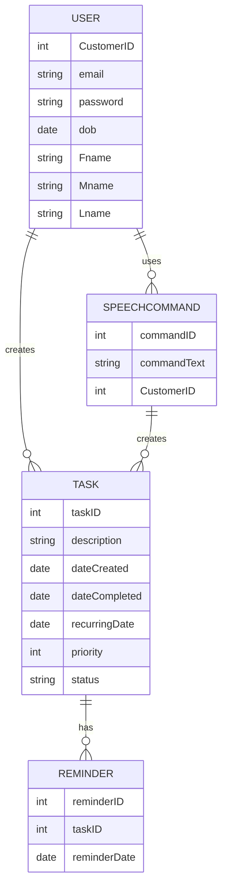

```mermaid
erDiagram
    USER ||--o{ TASK : "creates"
    USER ||--o{ SPEECHCOMMAND : "uses"
    SPEECHCOMMAND ||--o{ TASK : "creates"
    TASK ||--o{ REMINDER : "has"

    USER {
        int CustomerID
        string email
        string password
        date dob
        string Fname
        string Mname
        string Lname
    }
    
    TASK {
        int taskID
        string description
        date dateCreated
        date dateCompleted
        date recurringDate
        int priority
        string status
    }
    
    REMINDER {
        int reminderID
        int taskID
        date reminderDate
    }

    SPEECHCOMMAND {
        int commandID
        string commandText
        int CustomerID
    }
```